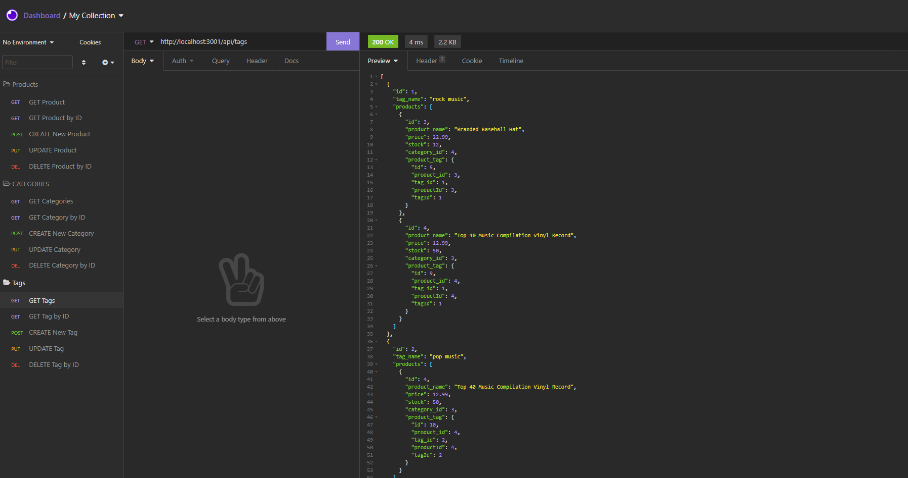

# Object-Relational Mapping (ORM): E-Commerce Back End

## Purpose

The purpose of this project was to modify some starter code to create the back end for an existing e-commerce application using Sequelize. This involved creation of the models, routing, and database storage/manipulation of the products, tags, and categories. 

Some features of the site are:
- THe user is able to load seeds into the database.
- The user is able to view all current products, categories, and tags.
- The user is able to view individual products, categories, and tags.
- The user is able to add products, categories, and tags to the database.
- The user is able to modify existing products, categories, and tags within the database.
- The user is able to delete products, categories, and tags from the database. 

Here is a short video displaying the application functionality: https://www.youtube.com/watch?v=GAO8kyYWqFM

---

## Appearance

### Here is an example of hitting the endpoint to view all of the tags in Insomnia:  

